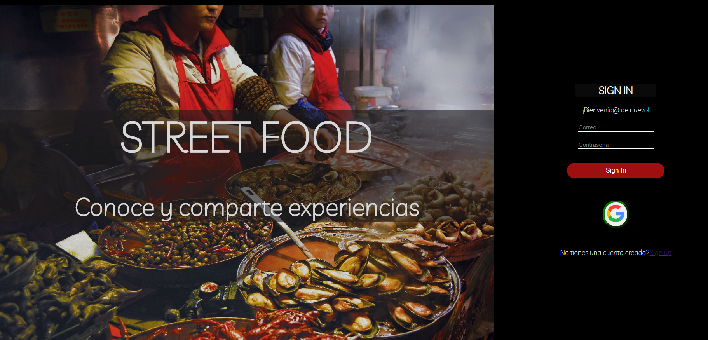
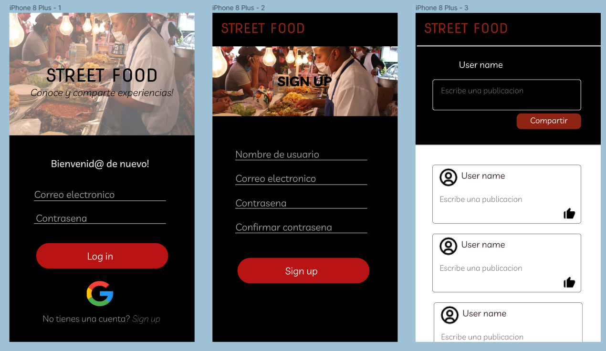

# Creando una red social: "Street Food"

## Introducción
Street Food es una red social enfocada a reunir y compartir experiencias acerca de puntos de comida callejera o puestos no muy conocidos, de modo que otras personas los conozcan y así disfrutar de buena comida.

## Producto final

## Diseño de la interfaz de usuario

### PROTOTIPO DE ALTA FIDELIDAD

### Feedback 
* Aumentar un texto estático indicando para que es la página.(Aquí encontrarás...) en la página principal.
* Las secciones dentro de la barra de navegación (desktop) tengan un mismo patrón de solo mayúsculas o minúsculas.
* Disminuir un poco la intensidad del color negro de la interfaz.

## Implementación de la interfaz de usuario

### Historia 1
Como usuario nuevo debo poder crear una cuenta con email y password válidos para ingresar
a la red social.

#### Criterios de aceptación
El usuario visualiza:
* Espacio para ingresar sus datos: correo, usuario, contraseña, confirmación de contraseña.
* Botón para terminar el registro
* El usuario debbe ingresar un email válido para concluir el registro
* Si el usuario deja una casilla en blanco, sale un alert para que ingrese esos datos.

#### Definición de terminado
* Pasar tests
* Responsive
* El registro es exitoso (los datos se guardan)

### Historia 2
Como usuario registrado debo poder iniciar sesión con email y password válidos para ingresar
a la red social.

#### Criterios de aceptación
* El usuario visualiza un espacio para ingresar sus datos de una cuenta ya creada.
* El usuario visualiza un botón para validar esos datos.
* Si los datos ingresados son incorrectos, te parece un alert.
* Si no se completa una casilla, te aparece un alert.

#### Definición de terminado
* Pasar tests
* Responsive
* El inicio de sesión es exitoso

### Historia 3
Como usuario nuevo debo poder iniciar sesión con mi cuenta de Google para ingresar a la red social (sin necesidad de crear una cuenta de email válido).

#### Criterios de aceptación
* El usuario visualiza un apartado en la vista de inicio de sesión para ingresar con su cuenta de Google.
* El usuario puede clickear el botón de Google para inciar sesión

#### Definición de terminado
* Pasar tests
* Responsive
* El inicio de sesión es exitoso con una cuenta de Google

### Historia 4
Como usuario loggeado debo poder crear, guardar, modificar en el mismo lugar (in place) y eliminar una publicación (post) privada o pública, que puede ser una frase o una imagen.

#### Criterios de aceptación
* El usuario visualiza una vista con los posts ya creados.
* El usuario visualiza un apartado para crear un post (espacio para escribir, un botón para insertar imagen y un botón para postear).
* El usuario puede escoger si la publicación es privada o pública.
* El usuario puede insertar una imagen o solo texto en un post.
* El usuario puede editar un post.
* El usuario puede eliminar un post.

#### Definición de terminado
* Pasar tests
* Responsive
* Se puede crear, modificar o eliminar un post en firebase y en la interfaz

### Historia 5
Como usuario loggeado debo poder ver todos los posts públicos y privados que he creado hasta ese momento, desde el más reciente hasta el más antiguo, así como la opción de poder cambiar la configuración de privacidad de mis posts para poder elegir la privacidad de mis publicaciones.

#### Criterios de aceptación
-El usuario visualiza una vista con los posts propios ya creados.
-El usuario puede escoger si la publicación es privada o pública.

#### Definición de terminado
* Pasar tests
* Responsive
* Se puede configurar y cambiar si la publicación es privada o pública
